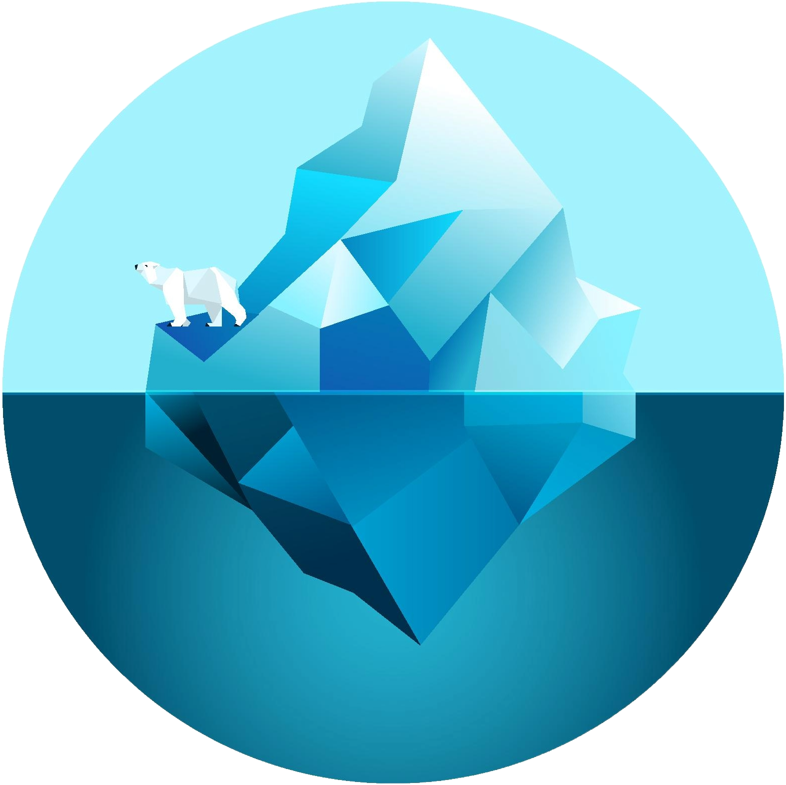
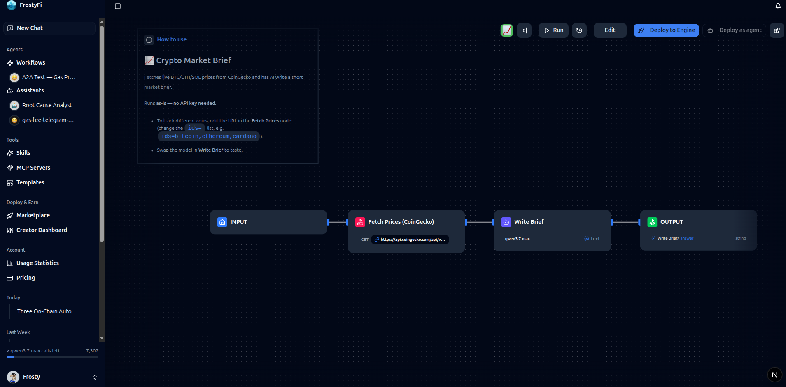
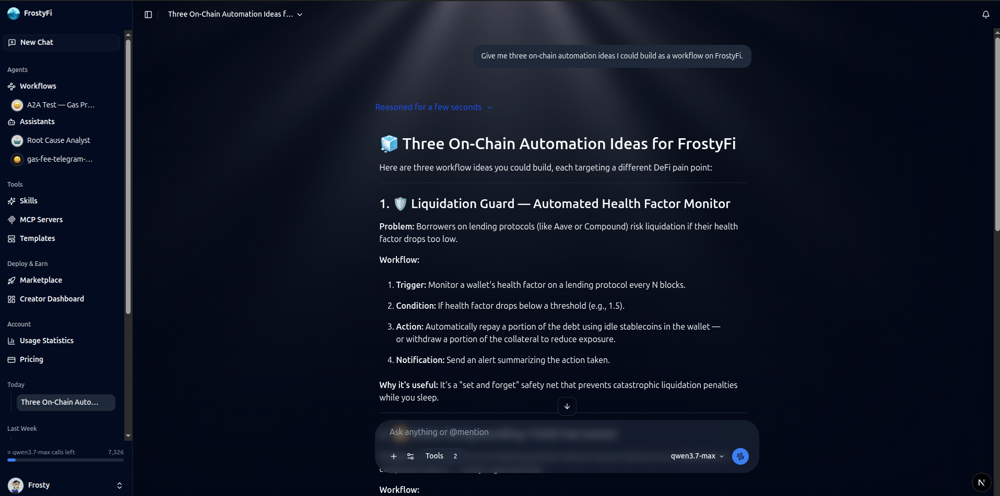
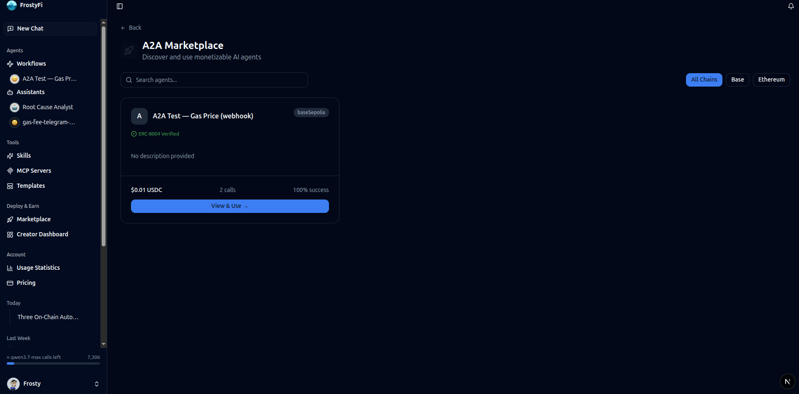
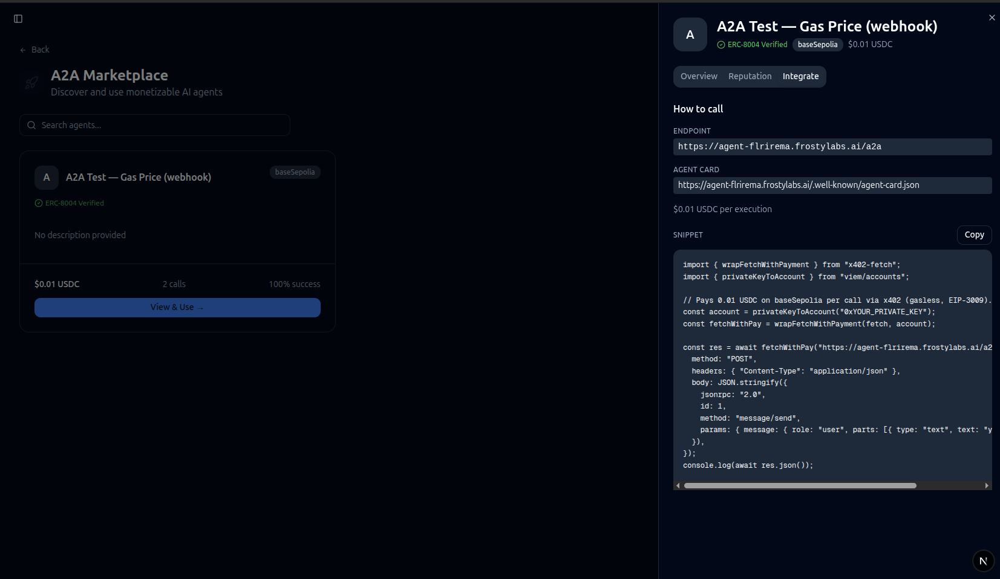
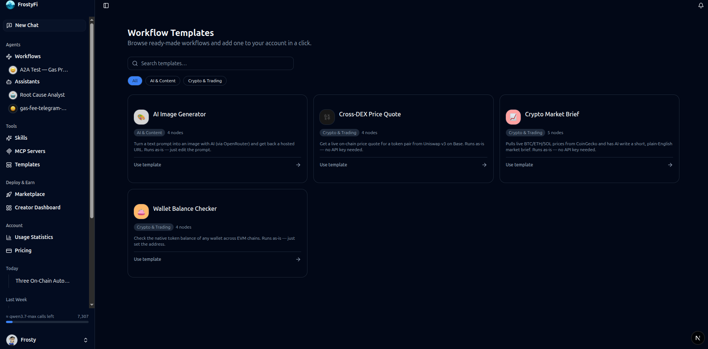

<div align="center">



# FrostyFi Documentation

### Build AI agents that think, act on-chain, and get paid.

FrostyFi is a visual workflow platform for AI agents and blockchain — compose
agents on a no-code canvas, deploy them as paid services with on-chain identity,
and let them earn USDC per request.

<p>
  <a href="https://frostylabs.ai"></a>
  <a href="https://app.frostylabs.ai"></a>
  <a href="https://docs.frostylabs.ai"></a>
</p>

<p>
  
  
  
  
</p>

</div>

---

<div align="center">
  
</div>

---

## What is FrostyFi?

Most automation tools stop at "call an API." FrostyFi goes further: the agents you
build have **on-chain identity** (ERC-8004), can **charge for their work** in USDC
per request (x402), and **talk to other agents** over the open A2A protocol — all
without writing a line of code.

- 🧩 **Visual workflow builder** — drag-and-drop nodes for LLMs, HTTP, conditions, loops, code, and on-chain actions.
- 🤖 **Agents that earn** — deploy any workflow as a paid agent. Callers pay per request in USDC on Base; settlement is verified on-chain.
- 🪪 **On-chain identity & reputation** — register agents under ERC-8004 so they're discoverable and accountable.
- 🔗 **Deep DeFi & multi-chain** — native nodes for Uniswap, SushiSwap, PancakeSwap, Hyperliquid, and Jupiter (Solana).
- 💬 **Full chat workspace** — bring your own models via OpenRouter, connect MCP servers, and run everything from one place.

> **Live on Base mainnet.** The full pay-to-call agent loop — request → x402 payment →
> on-chain settlement → result — is proven end-to-end against real transactions.

---

## See it in action

<table>
  <tr>
    <td width="50%" align="center">
      <br/>
      <strong>Chat workspace</strong><br/>
      <sub>Multi-model chat with MCP tools and workflow agents.</sub>
    </td>
    <td width="50%" align="center">
      <br/>
      <strong>Agent marketplace</strong><br/>
      <sub>Discover and call paid A2A agents.</sub>
    </td>
  </tr>
  <tr>
    <td width="50%" align="center">
      <br/>
      <strong>On-chain identity</strong><br/>
      <sub>ERC-8004 registration, explorer links, reputation.</sub>
    </td>
    <td width="50%" align="center">
      <br/>
      <strong>Templates</strong><br/>
      <sub>Clone a working workflow and run it in minutes.</sub>
    </td>
  </tr>
</table>

---

## Quick links

| | |
|---|---|
| 🌐 **Website** | https://frostylabs.ai |
| 🚀 **Launch the app** | https://app.frostylabs.ai |
| 📚 **Documentation** | https://docs.frostylabs.ai |
| ⚡ **Getting started** | https://docs.frostylabs.ai/docs/getting-started |
| 🧠 **Core concepts** | https://docs.frostylabs.ai/docs/concepts |
| 🤖 **Agents & A2A** | https://docs.frostylabs.ai/docs/agents |
| 💸 **Pricing** | https://docs.frostylabs.ai/docs/pricing |

---

## About this repo

This is the **FrostyFi documentation site**, built with
[Nextra](https://nextra.site/) (Next.js). Content lives in `pages/` as MDX.

### Run it locally

```bash
pnpm install
pnpm dev          # http://localhost:3000
```

### Build for production

```bash
pnpm build
pnpm start
```

### Project layout

```
docs-site/
├── pages/
│   ├── index.mdx          # docs landing
│   └── docs/              # all documentation pages (MDX)
│       ├── introduction.mdx
│       ├── getting-started.mdx
│       ├── concepts.mdx
│       ├── workflows.mdx
│       ├── agents.mdx
│       └── ...
├── public/
│   ├── resources/         # logo & brand assets
│   └── screenshots/       # product screenshots
├── theme.config.tsx       # Nextra theme (header, logo, footer)
└── next.config.mjs        # Nextra config
```

### Editing docs

1. Add or edit an `.mdx` file under `pages/docs/`.
2. Register it in the matching `_meta.json` to set its title and sidebar order.
3. Run `pnpm dev` and preview at `http://localhost:3000`.

---

<div align="center">
  <sub>Built by <a href="https://frostylabs.ai">FrostyLabs</a> · Agents that get paid, on-chain.</sub><br/>
  <a href="https://frostylabs.ai">Website</a> ·
  <a href="https://app.frostylabs.ai">App</a> ·
  <a href="https://docs.frostylabs.ai">Docs</a>
</div>
