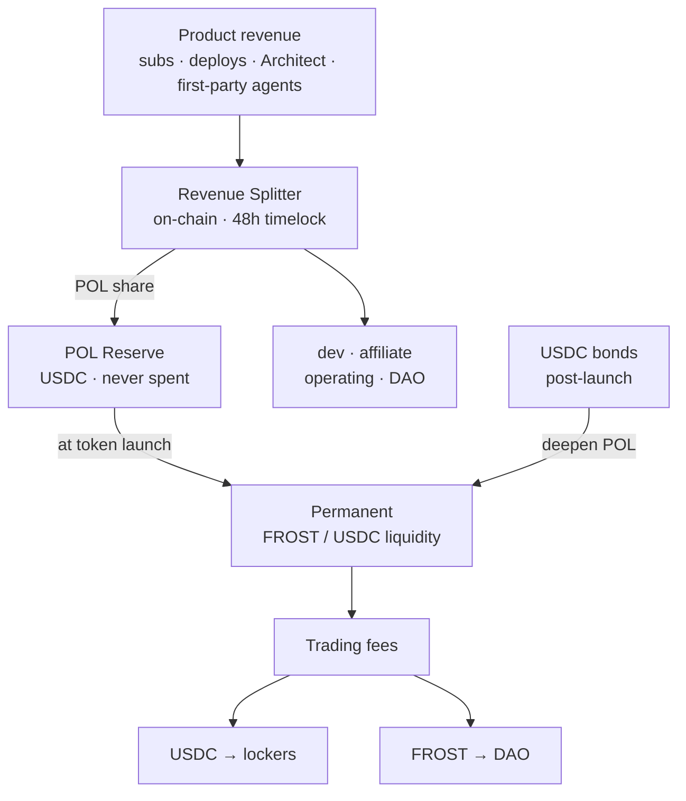
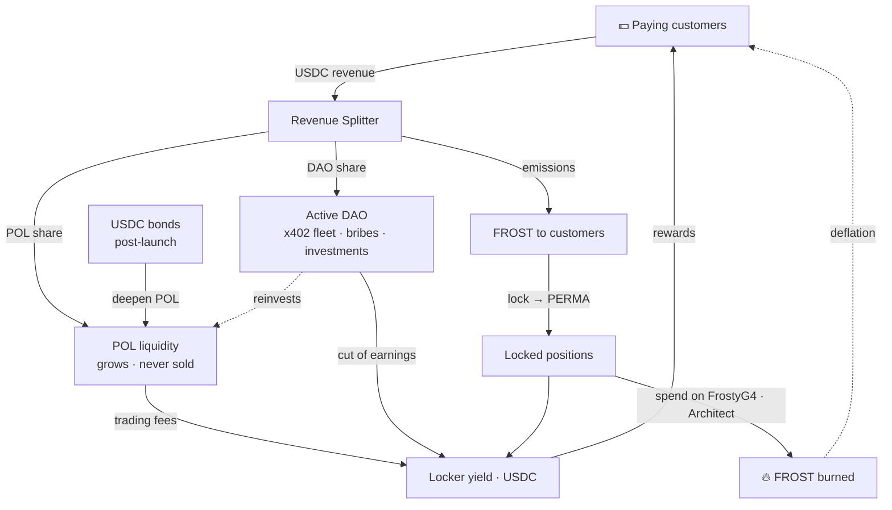

# POL — Protocol-Owned Liquidity

> How FrostyFi funds itself and builds its own permanent liquidity — from real product revenue, on-chain and verifiable, without VCs and without dumping tokens.

import { Callout } from 'nextra/components'

<Callout type="info">
The revenue splitter and the POL reserve are **deployed and source-verified on Base**. Every payment routes a fixed share to the reserve, which becomes permanent liquidity at token launch. Addresses are at the bottom of this page — check them yourself.
</Callout>

## What POL is

**POL = Protocol-Owned Liquidity.** Instead of renting liquidity from mercenary farmers who leave the moment incentives stop, the FrostyFi DAO *owns* the FROST/USDC liquidity outright. That liquidity:

- earns trading fees on every swap — a growing, protocol-owned income stream,
- can't be pulled out from under the market, and
- grows automatically as the product earns revenue.

POL turns the treasury into a productive endowment rather than a balance that only shrinks. It is the spine of the whole design and is **never sold**.

## Every payment splits on-chain

There is no off-chain accounting. Every payment — subscriptions, the $5 pay-per-deploy, Architect builds, and first-party agent fees — is pulled in USDC and split across five buckets in a single on-chain transaction by the `FrostyRevenueSplitter`.

**Clean streams** (pay-per-deploy, x402, first-party agents — no LLM cost):

| Bucket | Share | On a $5 payment |
|---|---|---|
| **POL Reserve** | **33%** | **$1.65** |
| Development | 45% | $2.25 |
| Affiliate (3 levels) | 10% | $0.50 |
| DAO Treasury | 7% | $0.35 |
| Operating | 5% | $0.25 |

**Subscription streams** ($25 Pro / $99 Enterprise — carry the LLM bill):

| Bucket | Share | On a $25 subscription |
|---|---|---|
| **POL Reserve** | **30%** | **$7.50** |
| Development | 37% | $9.25 |
| Affiliate (3 levels) | 10% | $2.50 |
| Operating (LLM + infra) | 16% | $4.00 |
| DAO Treasury | 7% | $1.75 |

<Callout type="info">
**No referrer? Your payment funds liquidity instead.** When a payment has no affiliate, that 10% rolls into POL — so a direct Pro subscription sends **$10.00 (40%)** straight to the reserve.
</Callout>

## The reserve, before and after launch

**Before token launch** — the POL share accumulates as **USDC** in a single, public reserve address. It is never touched. *"The reserve is at $X and has never been spent"* is a claim anyone can verify on Basescan.

**At token launch** — the entire reserve is deployed as permanent **FROST/USDC** liquidity, owned by the protocol.

**After launch** — the POL share keeps flowing, forever. Each payment market-buys FROST and adds to one canonical liquidity position, so revenue becomes real, verifiable buy pressure — not a batch you have to trust happens. POL only grows and never sells.

**Bonds accelerate it.** Revenue deepens POL steadily, but a young pool needs depth fast. After launch, anyone can bond USDC for discounted $FROST (vesting ~7 days) and the USDC goes straight into POL — so a single bond can add more depth than months of revenue. See **[Tokenomics → Bonds](/docs/tokenomics)**.

## Real yield for lockers

The liquidity POL owns earns trading fees in **both** tokens. That income has a destination:

- **USDC side → lockers, 100%.** Lock FROST, receive a soulbound **PERMA** position, and earn a share of real USDC fees — Aerodrome's model pointed at protocol-owned liquidity. See **[Tokenomics](/docs/tokenomics)**.
- **FROST side → the DAO treasury.** The DAO is an active earner — first-party x402 agents, liquidity bribes, and voted investments — and a disclosed cut of its USDC earnings is paid to lockers too. It never pays anyone in FROST.

Because "POL grows" and "locker yield grows" are the same event, deepening liquidity directly rewards long-term holders.

## The full flywheel

Every piece feeds the next: revenue deepens the liquidity that pays lockers, the token it distributes is earned by the customers who generate that revenue, and spending it burns supply — so the loop tightens as it turns.

## Governance & custody

The splitter is owned by a **48-hour `TimelockController`** behind a multisig. Every parameter — bucket splits, streams, attributors — can only change after 48 hours of public notice. The POL reserve, DAO treasury, and admin roles are held in **2-of-3 multisigs**. Parameters migrate to DAO control on a published schedule; there is no silent path.

## Verify on-chain

Everything above is checkable. Contracts are source-verified on Basescan.

| Contract | Base mainnet |
|---|---|
| POL Reserve | [`0xad75685B9F297aab468b584bC2E084D7677E58cB`](https://basescan.org/address/0xad75685B9F297aab468b584bC2E084D7677E58cB) |
| Revenue Splitter | [`0x5663213c20dd4d62E6f69ec240FE2f4e88B4dFd6`](https://basescan.org/address/0x5663213c20dd4d62E6f69ec240FE2f4e88B4dFd6#code) |
| Subscriptions (V2) | [`0x60A94c4632bcb56fF89813fe57Af63ef5084C215`](https://basescan.org/address/0x60A94c4632bcb56fF89813fe57Af63ef5084C215#code) |

See the live reserve in the app at **FrostyDAO → Reserve**.
