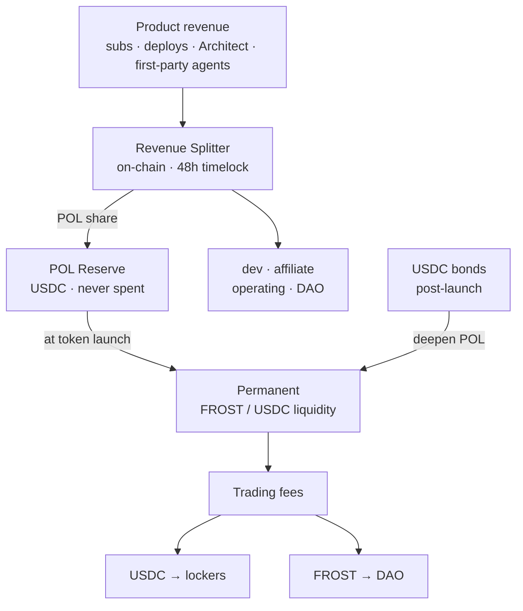
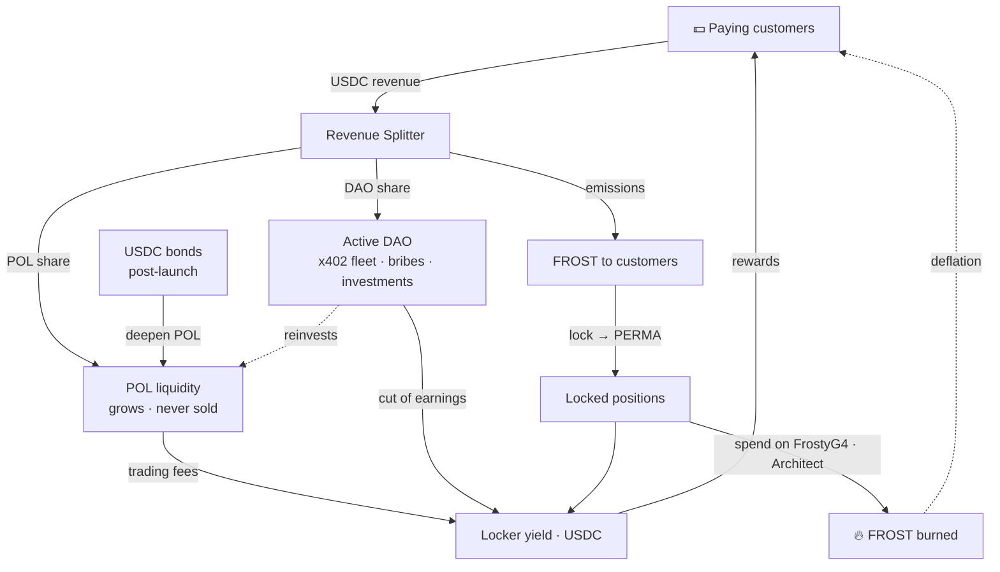

# POL — Liquidez Propiedad del Protocolo

> Cómo FrostyFi se financia a sí mismo y construye su propia liquidez permanente — a partir de ingresos reales del producto, on-chain y verificables, sin VCs y sin volcar tokens al mercado.

import { Callout } from 'nextra/components'

<Callout type="info">
El divisor de ingresos y la reserva POL están **desplegados y verificados en el código fuente en Base**. Cada pago enruta una porción fija a la reserva, que se convierte en liquidez permanente en el lanzamiento del token. Las direcciones están al final de esta página — compruébalas tú mismo.
</Callout>

## Qué es POL

**POL = Liquidez Propiedad del Protocolo (Protocol-Owned Liquidity).** En lugar de alquilar liquidez a agricultores mercenarios que se van en el momento en que cesan los incentivos, la DAO de FrostyFi *posee* la liquidez FROST/USDC directamente. Esa liquidez:

- gana comisiones de trading en cada swap — un flujo de ingresos creciente y propiedad del protocolo,
- no puede ser retirada de debajo del mercado, y
- crece automáticamente a medida que el producto genera ingresos.

POL convierte la tesorería en una dotación productiva en lugar de un saldo que solo se reduce. Es la columna vertebral de todo el diseño y **nunca se vende**.

## Cada pago se divide on-chain

No hay contabilidad off-chain. Cada pago — suscripciones, el pago-por-despliegue de $5, las construcciones del Architect y las comisiones de agentes propios — se cobra en USDC y se divide en cinco cubetas en una única transacción on-chain por el `FrostyRevenueSplitter`.

**Flujos limpios** (pago-por-despliegue, x402, agentes propios — sin coste de LLM):

| Cubeta | Porción | En un pago de $5 |
|---|---|---|
| **Reserva POL** | **33%** | **$1.65** |
| Desarrollo | 45% | $2.25 |
| Afiliado (3 niveles) | 10% | $0.50 |
| Tesorería de la DAO | 7% | $0.35 |
| Operación | 5% | $0.25 |

**Flujos de suscripción** ($25 Pro / $99 Enterprise — cargan con la factura del LLM):

| Cubeta | Porción | En una suscripción de $25 |
|---|---|---|
| **Reserva POL** | **30%** | **$7.50** |
| Desarrollo | 37% | $9.25 |
| Afiliado (3 niveles) | 10% | $2.50 |
| Operación (LLM + infra) | 16% | $4.00 |
| Tesorería de la DAO | 7% | $1.75 |

<Callout type="info">
**¿Sin referente? Tu pago financia la liquidez en su lugar.** Cuando un pago no tiene afiliado, ese 10% se traslada a POL — por lo que una suscripción Pro directa envía **$10.00 (40%)** directo a la reserva.
</Callout>

## La reserva, antes y después del lanzamiento

**Antes del lanzamiento del token** — la porción de POL se acumula como **USDC** en una única dirección de reserva pública. Nunca se toca. *"La reserva está en $X y nunca se ha gastado"* es una afirmación que cualquiera puede verificar en Basescan.

**En el lanzamiento del token** — toda la reserva se despliega como liquidez permanente **FROST/USDC**, propiedad del protocolo.

**Después del lanzamiento** — la porción de POL sigue fluyendo, para siempre. Cada pago compra FROST en el mercado y se añade a una posición de liquidez canónica, por lo que los ingresos se convierten en presión de compra real y verificable — no en un lote que tienes que confiar en que ocurra. POL solo crece y nunca vende.

**Los bonos lo aceleran.** Los ingresos profundizan POL de forma constante, pero un pool joven necesita profundidad rápido. Tras el lanzamiento, cualquiera puede bonar USDC por $FROST con descuento (con vesting de ~7 días) y el USDC va directo a POL — por lo que un solo bono puede añadir más profundidad que meses de ingresos. Consulta **[Tokenomics → Bonos](/docs/tokenomics)**.

## Rendimiento real para quienes bloquean

La liquidez que posee POL gana comisiones de trading en **ambos** tokens. Ese ingreso tiene un destino:

- **Lado USDC → quienes bloquean, 100%.** Bloquea FROST, recibe una posición **PERMA** soulbound, y gana una porción de comisiones reales en USDC — el modelo de Aerodrome apuntado a la liquidez propiedad del protocolo. Consulta **[Tokenomics](/docs/tokenomics)**.
- **Lado FROST → la tesorería de la DAO.** La DAO es un generador de ingresos activo — agentes x402 propios, sobornos de liquidez e inversiones votadas — y una porción divulgada de sus ingresos en USDC también se paga a quienes bloquean. Nunca paga a nadie en FROST.

Como "POL crece" y "el rendimiento de quienes bloquean crece" son el mismo evento, profundizar la liquidez recompensa directamente a los holders a largo plazo.

## El volante completo

Cada pieza alimenta la siguiente: los ingresos profundizan la liquidez que paga a quienes bloquean, el token que distribuye es ganado por los clientes que generan esos ingresos, y gastarlo quema suministro — por lo que el ciclo se aprieta a medida que gira.

## Gobernanza y custodia

El divisor es propiedad de un **`TimelockController` de 48 horas** detrás de un multisig. Cada parámetro — divisiones de cubetas, flujos, atribuidores — solo puede cambiar tras 48 horas de aviso público. La reserva POL, la tesorería de la DAO y los roles de administración se mantienen en **multisigs de 2 de 3**. Los parámetros migran al control de la DAO en un calendario publicado; no hay ninguna ruta silenciosa.

## Verifica on-chain

Todo lo anterior es comprobable. Los contratos están verificados en el código fuente en Basescan.

| Contrato | Mainnet de Base |
|---|---|
| Reserva POL | [`0xad75685B9F297aab468b584bC2E084D7677E58cB`](https://basescan.org/address/0xad75685B9F297aab468b584bC2E084D7677E58cB) |
| Revenue Splitter | [`0x5663213c20dd4d62E6f69ec240FE2f4e88B4dFd6`](https://basescan.org/address/0x5663213c20dd4d62E6f69ec240FE2f4e88B4dFd6#code) |
| Suscripciones (V2) | [`0x60A94c4632bcb56fF89813fe57Af63ef5084C215`](https://basescan.org/address/0x60A94c4632bcb56fF89813fe57Af63ef5084C215#code) |

Consulta la reserva en vivo en la app en **FrostyDAO → Reserva**.
