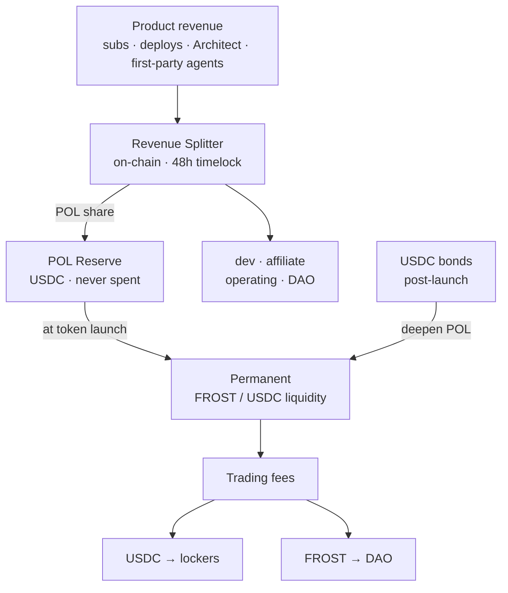
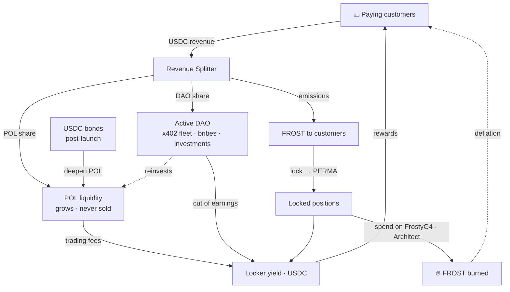

# POL — Liquidité détenue par le protocole

> Comment FrostyFi se finance et construit sa propre liquidité permanente — à partir de revenus produits réels, on-chain et vérifiables, sans VC et sans brader de jetons.

import { Callout } from 'nextra/components'

<Callout type="info">
Le répartiteur de revenus et la réserve POL sont **déployés et vérifiés par la source sur Base**. Chaque paiement achemine une part fixe vers la réserve, qui devient une liquidité permanente au lancement du jeton. Les adresses figurent au bas de cette page — vérifiez-les vous-même.
</Callout>

## Ce qu'est la POL

**POL = Liquidité détenue par le protocole (Protocol-Owned Liquidity).** Au lieu de louer de la liquidité auprès de fermiers mercenaires qui partent dès que les incitations cessent, la DAO FrostyFi *détient* purement et simplement la liquidité FROST/USDC. Cette liquidité :

- perçoit des frais de trading sur chaque échange — un flux de revenus croissant et détenu par le protocole,
- ne peut pas être retirée sous le marché, et
- croît automatiquement à mesure que le produit génère des revenus.

La POL transforme la trésorerie en une dotation productive plutôt qu'en un solde qui ne fait que rétrécir. Elle est la colonne vertébrale de toute la conception et n'est **jamais vendue**.

## Chaque paiement se répartit on-chain

Il n'y a pas de comptabilité hors chaîne. Chaque paiement — abonnements, le pay-per-deploy à 5 $, les constructions Architect et les frais d'agents de première partie — est prélevé en USDC et réparti entre cinq compartiments en une seule transaction on-chain par le `FrostyRevenueSplitter`.

**Flux propres** (pay-per-deploy, x402, agents de première partie — sans coût LLM) :

| Compartiment | Part | Sur un paiement de 5 $ |
|---|---|---|
| **Réserve POL** | **33 %** | **1,65 $** |
| Développement | 45 % | 2,25 $ |
| Affiliation (3 niveaux) | 10 % | 0,50 $ |
| Trésorerie DAO | 7 % | 0,35 $ |
| Exploitation | 5 % | 0,25 $ |

**Flux d'abonnement** (Pro à 25 $ / Enterprise à 99 $ — supportent la facture LLM) :

| Compartiment | Part | Sur un abonnement de 25 $ |
|---|---|---|
| **Réserve POL** | **30 %** | **7,50 $** |
| Développement | 37 % | 9,25 $ |
| Affiliation (3 niveaux) | 10 % | 2,50 $ |
| Exploitation (LLM + infra) | 16 % | 4,00 $ |
| Trésorerie DAO | 7 % | 1,75 $ |

<Callout type="info">
**Pas de parrain ? Votre paiement finance la liquidité à la place.** Lorsqu'un paiement n'a pas d'affilié, ces 10 % basculent dans la POL — de sorte qu'un abonnement Pro direct envoie **10,00 $ (40 %)** directement à la réserve.
</Callout>

## La réserve, avant et après le lancement

**Avant le lancement du jeton** — la part POL s'accumule sous forme d'**USDC** dans une adresse de réserve unique et publique. Elle n'est jamais touchée. *« La réserve est à X $ et n'a jamais été dépensée »* est une affirmation que quiconque peut vérifier sur Basescan.

**Au lancement du jeton** — l'intégralité de la réserve est déployée comme liquidité **FROST/USDC** permanente, détenue par le protocole.

**Après le lancement** — la part POL continue d'affluer, pour toujours. Chaque paiement achète FROST au marché et vient s'ajouter à une position de liquidité canonique unique, de sorte que les revenus deviennent une pression d'achat réelle et vérifiable — et non un lot dont il faut espérer qu'il se produise. La POL ne fait que croître et ne vend jamais.

**Les bonds l'accélèrent.** Les revenus approfondissent la POL de façon régulière, mais un pool jeune a besoin de profondeur rapidement. Après le lancement, quiconque peut apporter de l'USDC en bond contre du $FROST à prix réduit (acquisition sur ~7 jours) et l'USDC va directement dans la POL — ainsi un seul bond peut ajouter plus de profondeur que des mois de revenus. Voir **[Tokenomics → Bonds](/docs/tokenomics)**.

## Un rendement réel pour ceux qui verrouillent

La liquidité que détient la POL perçoit des frais de trading dans les **deux** jetons. Ce revenu a une destination :

- **Côté USDC → à ceux qui verrouillent, 100 %.** Verrouillez du FROST, recevez une position **PERMA** soulbound, et percevez une part de frais réels en USDC — le modèle d'Aerodrome orienté vers une liquidité détenue par le protocole. Voir **[Tokenomics](/docs/tokenomics)**.
- **Côté FROST → la trésorerie de la DAO.** La DAO est un acteur qui génère activement des revenus — agents x402 de première partie, bribes de liquidité et investissements votés — et une part divulguée de ses revenus en USDC est également versée à ceux qui verrouillent. Elle ne paie jamais personne en FROST.

Parce que « la POL croît » et « le rendement de ceux qui verrouillent croît » sont le même événement, approfondir la liquidité récompense directement les détenteurs de long terme.

## Le volant d'inertie complet

Chaque pièce alimente la suivante : les revenus approfondissent la liquidité qui rémunère ceux qui verrouillent, le jeton qu'elle distribue est gagné par les clients qui génèrent ces revenus, et le dépenser brûle de l'offre — de sorte que la boucle se resserre à mesure qu'elle tourne.

## Gouvernance & garde

Le répartiteur est détenu par un **`TimelockController` de 48 heures** derrière un multisig. Chaque paramètre — répartitions des compartiments, flux, attributeurs — ne peut changer qu'après 48 heures de préavis public. La réserve POL, la trésorerie DAO et les rôles d'administration sont détenus dans des **multisigs 2-sur-3**. Les paramètres migrent vers le contrôle de la DAO selon un calendrier publié ; il n'y a pas de voie silencieuse.

## Vérifier on-chain

Tout ce qui précède est vérifiable. Les contrats sont vérifiés par la source sur Basescan.

| Contrat | Mainnet Base |
|---|---|
| Réserve POL | [`0xad75685B9F297aab468b584bC2E084D7677E58cB`](https://basescan.org/address/0xad75685B9F297aab468b584bC2E084D7677E58cB) |
| Répartiteur de revenus | [`0x5663213c20dd4d62E6f69ec240FE2f4e88B4dFd6`](https://basescan.org/address/0x5663213c20dd4d62E6f69ec240FE2f4e88B4dFd6#code) |
| Abonnements (V2) | [`0x60A94c4632bcb56fF89813fe57Af63ef5084C215`](https://basescan.org/address/0x60A94c4632bcb56fF89813fe57Af63ef5084C215#code) |

Consultez la réserve en direct dans l'application via **FrostyDAO → Reserve**.
