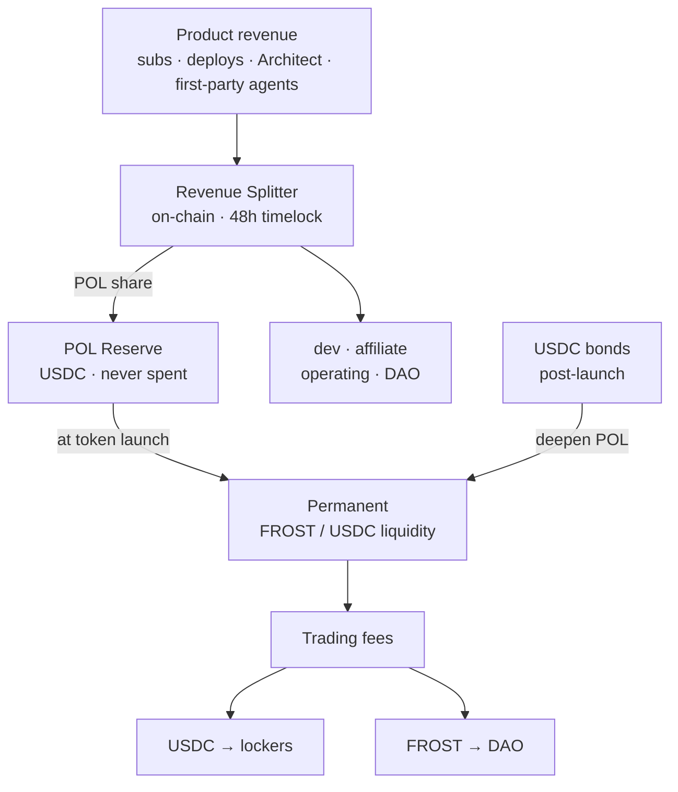
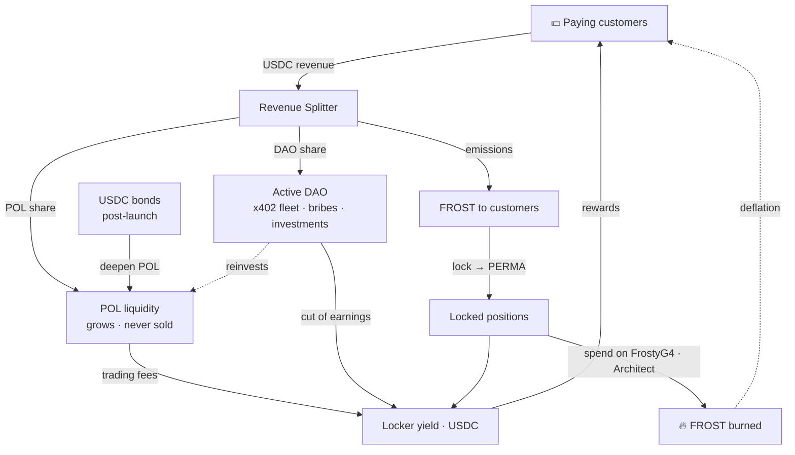

# POL — プロトコル所有流動性

> FrostyFi がどのように自らを賄い、自身の永続的な流動性を築くか — 実際のプロダクト収益から、オンチェーンで検証可能に、VC なしで、そしてトークンを投げ売りすることなく。

import { Callout } from 'nextra/components'

<Callout type="info">
収益スプリッターと POL 準備金は、**Base 上でデプロイされソース検証されています**。すべての支払いは固定の割合を準備金へルーティングし、それはトークンローンチ時に永続的な流動性になります。アドレスはこのページの下部にあります — 自分で確認してください。
</Callout>

## POL とは

**POL = プロトコル所有流動性（Protocol-Owned Liquidity）。** インセンティブが止まった瞬間に去る傭兵的なファーマーから流動性を借りる代わりに、FrostyFi DAO は FROST/USDC の流動性を完全に *所有* します。その流動性は：

- すべてのスワップで取引手数料を稼ぎます — 成長する、プロトコル所有の収入源、
- 市場の足元からいきなり引き抜かれることがなく、そして
- プロダクトが収益を稼ぐにつれて自動的に成長します。

POL は、トレジャリーを、縮小するだけの残高ではなく、生産的な基金に変えます。それは設計全体の背骨であり、**決して売られません**。

## すべての支払いはオンチェーンで分割される

オフチェーンの会計はありません。すべての支払い — サブスクリプション、$5 の pay-per-deploy、Architect ビルド、ファーストパーティのエージェント手数料 — は USDC で引き込まれ、`FrostyRevenueSplitter` によって単一のオンチェーントランザクションで 5 つのバケットに分割されます。

**クリーンストリーム**（pay-per-deploy、x402、ファーストパーティエージェント — LLM コストなし）：

| バケット | 割合 | $5 の支払いに対して |
|---|---|---|
| **POL 準備金** | **33%** | **$1.65** |
| 開発 | 45% | $2.25 |
| アフィリエイト（3 レベル） | 10% | $0.50 |
| DAO トレジャリー | 7% | $0.35 |
| オペレーティング | 5% | $0.25 |

**サブスクリプションストリーム**（$25 Pro / $99 Enterprise — LLM の請求を負う）：

| バケット | 割合 | $25 のサブスクリプションに対して |
|---|---|---|
| **POL 準備金** | **30%** | **$7.50** |
| 開発 | 37% | $9.25 |
| アフィリエイト（3 レベル） | 10% | $2.50 |
| オペレーティング（LLM + インフラ） | 16% | $4.00 |
| DAO トレジャリー | 7% | $1.75 |

<Callout type="info">
**リファラーなし？ あなたの支払いは代わりに流動性に資金を供給します。** 支払いにアフィリエイトがない場合、その 10% は POL に転がり込みます — したがって、直接の Pro サブスクリプションは **$10.00（40%）** をまっすぐ準備金に送ります。
</Callout>

## ローンチ前と後の準備金

**トークンローンチ前** — POL の分け前は、単一の公開された準備金アドレスに **USDC** として積み立てられます。決して手を付けられません。*「準備金は $X にあり、一度も使われていない」* は、誰でも Basescan で検証できる主張です。

**トークンローンチ時** — 準備金全体が、プロトコルが所有する永続的な **FROST/USDC** 流動性としてデプロイされます。

**ローンチ後** — POL の分け前は流れ続けます、永遠に。各支払いが FROST を市場で買い、1 つの正典的な流動性ポジションに追加するため、収益は、起きると信じるしかないバッチではなく、実際の検証可能な買い圧になります。POL は成長するだけで、決して売りません。

**ボンドがそれを加速します。** 収益は POL を着実に深めますが、若いプールは深さを速く必要とします。ローンチ後、誰でも割引された $FROST のために USDC をボンドでき（約 7 日でベスト）、その USDC はまっすぐ POL に入ります — したがって、たった 1 回のボンドが数か月分の収益より多くの深さを追加できます。**[トークノミクス → ボンド](/docs/tokenomics)** を参照。

## ロッカーのためのリアルイールド

POL が所有する流動性は、**両方の** トークンで取引手数料を稼ぎます。その収入には行き先があります：

- **USDC 側 → ロッカーに 100%。** FROST をロックし、ソウルバウンドな **PERMA** ポジションを受け取り、実際の USDC 手数料の分け前を稼ぎます — Aerodrome のモデルをプロトコル所有流動性に向けたものです。**[トークノミクス](/docs/tokenomics)** を参照。
- **FROST 側 → DAO トレジャリー。** DAO はアクティブな稼ぎ手です — ファーストパーティの x402 エージェント、流動性への賄賂、投票による投資 — そしてその USDC 収益の開示された一部も、ロッカーに支払われます。それが誰かに FROST で支払うことは決してありません。

「POL が成長する」と「ロッカーの利回りが成長する」は同じ出来事なので、流動性を深めることが、長期保有者に直接報います。

## 完全なフライホイール

すべての部品が次を養います：収益はロッカーに支払う流動性を深め、それが分配するトークンはその収益を生む顧客によって獲得され、それを費やすことは供給をバーンします — したがって、ループは回るにつれて締まっていきます。

## ガバナンスと保管

スプリッターは、マルチシグの背後にある **48 時間の `TimelockController`** によって所有されます。すべてのパラメータ — バケットの分割、ストリーム、attributor — は、48 時間の公開告知の後にのみ変更できます。POL 準備金、DAO トレジャリー、管理者ロールは **2-of-3 のマルチシグ** で保持されます。パラメータは公開されたスケジュールで DAO の制御へ移行します。密かな経路はありません。

## オンチェーンで検証する

上記のすべては確認可能です。コントラクトは Basescan でソース検証されています。

| コントラクト | Base メインネット |
|---|---|
| POL Reserve | [`0xad75685B9F297aab468b584bC2E084D7677E58cB`](https://basescan.org/address/0xad75685B9F297aab468b584bC2E084D7677E58cB) |
| Revenue Splitter | [`0x5663213c20dd4d62E6f69ec240FE2f4e88B4dFd6`](https://basescan.org/address/0x5663213c20dd4d62E6f69ec240FE2f4e88B4dFd6#code) |
| Subscriptions (V2) | [`0x60A94c4632bcb56fF89813fe57Af63ef5084C215`](https://basescan.org/address/0x60A94c4632bcb56fF89813fe57Af63ef5084C215#code) |

ライブな準備金は、アプリの **FrostyDAO → Reserve** で確認できます。
