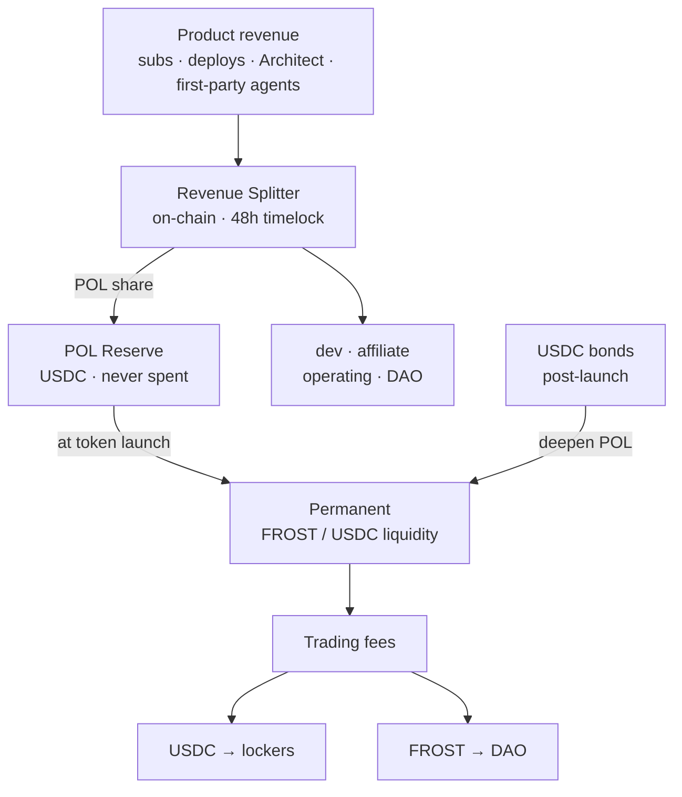
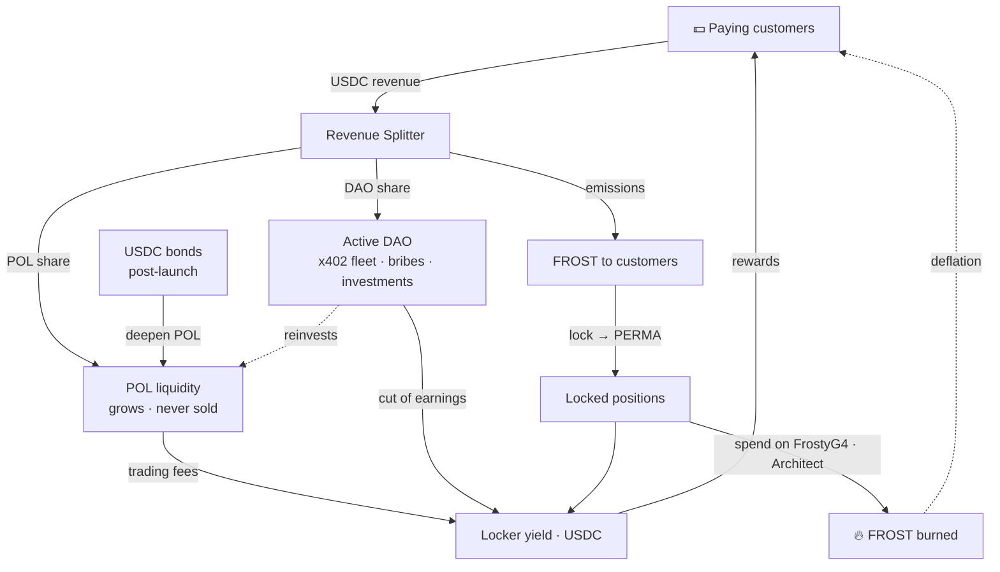

# POL — 프로토콜 소유 유동성

> FrostyFi가 어떻게 스스로 자금을 조달하고 자신의 영구 유동성을 구축하는가 — 실제 제품 수익으로부터, 온체인에서 검증 가능하게, VC 없이 그리고 토큰을 덤핑하지 않고.

import { Callout } from 'nextra/components'

<Callout type="info">
수익 스플리터와 POL 리저브는 **Base에 배포되어 있고 소스가 검증되어** 있습니다. 모든 결제는 고정된 몫을 리저브로 라우팅하며, 이는 토큰 출시 시점에 영구 유동성이 됩니다. 주소는 이 페이지 하단에 있습니다 — 직접 확인해 보세요.
</Callout>

## POL이란 무엇인가

**POL = 프로토콜 소유 유동성.** 인센티브가 멈추는 순간 떠나는 용병 파머로부터 유동성을
빌리는 대신, FrostyFi DAO는 FROST/USDC 유동성을 온전히 *소유*합니다. 그 유동성은:

- 모든 스왑에서 거래 수수료를 법니다 — 성장하는, 프로토콜 소유의 수입원,
- 시장 밑에서 빼낼 수 없으며,
- 제품이 수익을 벌면서 자동으로 성장합니다.

POL은 오직 줄어들기만 하는 잔고가 아니라 트레저리를 생산적인 기금으로 바꿉니다. 이는
전체 설계의 척추이며 **결코 매도되지 않습니다**.

## 모든 결제는 온체인에서 분할됩니다

오프체인 회계는 없습니다. 모든 결제 — 구독, $5 페이-퍼-디플로이, Architect 빌드,
퍼스트파티 에이전트 수수료 — 는 USDC로 끌어와 `FrostyRevenueSplitter`에 의해 단일
온체인 트랜잭션으로 다섯 개의 버킷에 걸쳐 분할됩니다.

**클린 스트림**(페이-퍼-디플로이, x402, 퍼스트파티 에이전트 — LLM 비용 없음):

| 버킷 | 비중 | $5 결제 시 |
|---|---|---|
| **POL 리저브** | **33%** | **$1.65** |
| 개발 | 45% | $2.25 |
| 제휴(3레벨) | 10% | $0.50 |
| DAO 트레저리 | 7% | $0.35 |
| 운영 | 5% | $0.25 |

**구독 스트림**($25 Pro / $99 Enterprise — LLM 청구서 부담):

| 버킷 | 비중 | $25 구독 시 |
|---|---|---|
| **POL 리저브** | **30%** | **$7.50** |
| 개발 | 37% | $9.25 |
| 제휴(3레벨) | 10% | $2.50 |
| 운영(LLM + 인프라) | 16% | $4.00 |
| DAO 트레저리 | 7% | $1.75 |

<Callout type="info">
**추천인이 없나요? 여러분의 결제가 대신 유동성을 지원합니다.** 결제에 제휴가 없으면, 그 10%는 POL로 굴러 들어갑니다 — 그래서 직접 Pro 구독은 **$10.00(40%)**를 곧바로 리저브로 보냅니다.
</Callout>

## 리저브, 출시 전과 후

**토큰 출시 전** — POL 몫은 단일 공개 리저브 주소에 **USDC**로 누적됩니다. 결코
손대지 않습니다. *"리저브는 $X이고 결코 지출된 적이 없다"*는 것은 누구나 Basescan에서
검증할 수 있는 주장입니다.

**토큰 출시 시점** — 전체 리저브가 프로토콜이 소유하는 영구 **FROST/USDC** 유동성으로
배치됩니다.

**출시 후** — POL 몫은 영원히 계속 흐릅니다. 각 결제는 FROST를 시장 매수하고 하나의
정규 유동성 포지션에 추가하므로, 수익은 발생한다고 신뢰해야 하는 배치가 아니라 실제
검증 가능한 매수 압력이 됩니다. POL은 오직 성장하고 결코 매도하지 않습니다.

**본드가 이를 가속화합니다.** 수익은 POL을 꾸준히 깊게 만들지만, 젊은 풀은 깊이가 빠르게
필요합니다. 출시 후에는 누구나 할인된 $FROST를 위해 USDC를 본딩할 수 있고(약 7일 베스팅)
USDC는 곧바로 POL로 갑니다 — 그래서 단일 본드가 몇 달치 수익보다 더 많은 깊이를 추가할
수 있습니다. **[토크노믹스 → 본드](/docs/tokenomics)**를 참조하세요.

## 락커를 위한 리얼 일드

POL이 소유한 유동성은 **두** 토큰 모두로 거래 수수료를 법니다. 그 수입에는 목적지가 있습니다:

- **USDC 쪽 → 락커에게 100%.** FROST를 락하고, 소울바운드 **PERMA** 포지션을 받고,
  실제 USDC 수수료의 일부를 버세요 — Aerodrome의 모델을 프로토콜 소유 유동성에 겨눈 것입니다.
  **[토크노믹스](/docs/tokenomics)**를 참조하세요.
- **FROST 쪽 → DAO 트레저리.** DAO는 능동적인 수익 창출자입니다 — 퍼스트파티 x402
  에이전트, 유동성 뇌물, 투표된 투자 — 그리고 그 USDC 수익의 공개된 일부도 락커에게
  지급됩니다. 결코 누구에게도 FROST로 지급하지 않습니다.

"POL이 성장한다"와 "락커 일드가 성장한다"는 동일한 사건이기 때문에, 유동성을 깊게 하는
것은 장기 보유자에게 직접 보상합니다.

## 전체 플라이휠

모든 조각이 다음을 먹여 살립니다: 수익은 락커에게 지급하는 유동성을 깊게 하고, 그것이
분배하는 토큰은 그 수익을 창출하는 고객이 획득하며, 그것을 지출하면 공급이 소각됩니다 —
그래서 루프는 돌수록 조여집니다.

## 거버넌스 & 커스터디

스플리터는 멀티시그 뒤의 **48시간 `TimelockController`**가 소유합니다. 모든 파라미터 —
버킷 분할, 스트림, 어트리뷰터 — 는 48시간의 공개 공지 후에만 변경될 수 있습니다. POL
리저브, DAO 트레저리, 관리자 역할은 **2-of-3 멀티시그**로 보유됩니다. 파라미터는 공개된
스케줄에 따라 DAO 통제로 이전됩니다. 조용한 경로는 없습니다.

## 온체인에서 검증하기

위의 모든 것은 확인 가능합니다. 컨트랙트는 Basescan에서 소스가 검증되어 있습니다.

| 컨트랙트 | Base 메인넷 |
|---|---|
| POL 리저브 | [`0xad75685B9F297aab468b584bC2E084D7677E58cB`](https://basescan.org/address/0xad75685B9F297aab468b584bC2E084D7677E58cB) |
| 수익 스플리터 | [`0x5663213c20dd4d62E6f69ec240FE2f4e88B4dFd6`](https://basescan.org/address/0x5663213c20dd4d62E6f69ec240FE2f4e88B4dFd6#code) |
| 구독(V2) | [`0x60A94c4632bcb56fF89813fe57Af63ef5084C215`](https://basescan.org/address/0x60A94c4632bcb56fF89813fe57Af63ef5084C215#code) |

앱에서 라이브 리저브를 **FrostyDAO → Reserve**에서 확인하세요.
