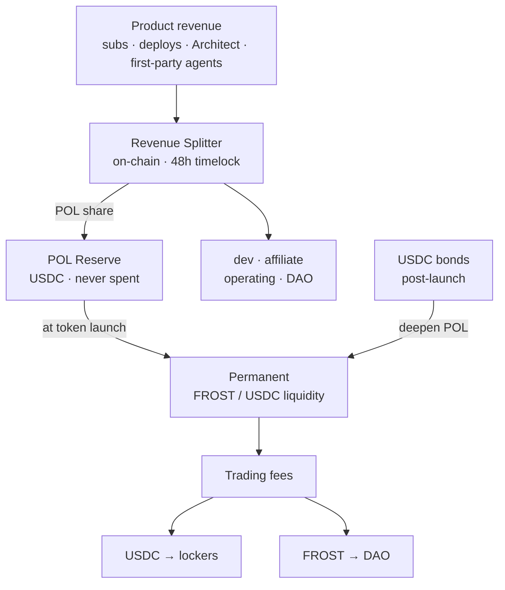
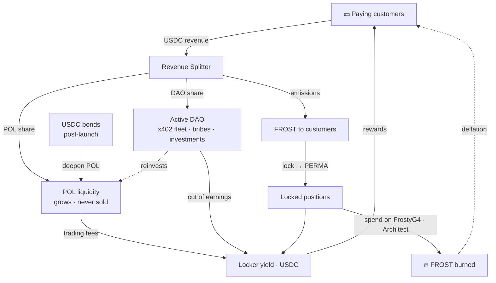

# POL —— 协议自有流动性

> FrostyFi 如何为自身提供资金并构建属于自己的永久流动性——完全来自真实的产品收入，链上可验证，不依赖 VC，也不抛售代币。

import { Callout } from 'nextra/components'

<Callout type="info">
收入分账器与 POL 储备**已在 Base 上部署并完成源码验证**。每一笔支付都会把固定份额路由到储备中，这部分储备在代币发行时会转化为永久流动性。地址列于本页底部——你可以自行核对。
</Callout>

## POL 是什么

**POL = 协议自有流动性（Protocol-Owned Liquidity）。** FrostyFi DAO 不向那些一旦激励停止就立刻离场的雇佣型「挖矿者」租用流动性，而是彻底*拥有* FROST/USDC 流动性。这部分流动性：

- 在每一次兑换中赚取交易手续费——一条不断增长、协议自有的收入流，
- 无法被从市场底下抽走，并且
- 随着产品赚取收入而自动增长。

POL 把金库变成一份富有生产力的捐赠基金，而不是一个只会缩水的余额。它是整套设计的脊梁，且**永不出售**。

## 每一笔支付都在链上分账

不存在任何链下会计。每一笔支付——订阅、$5 的按次部署、Architect 构建以及第一方智能体费用——都会以 USDC 收取，并由 `FrostyRevenueSplitter` 在单笔链上交易中拆分到五个桶里。

**干净收入流**（按次部署、x402、第一方智能体——无 LLM 成本）：

| 桶 | 份额 | 一笔 $5 支付 |
|---|---|---|
| **POL 储备** | **33%** | **$1.65** |
| 开发 | 45% | $2.25 |
| 联盟（3 级） | 10% | $0.50 |
| DAO 金库 | 7% | $0.35 |
| 运营 | 5% | $0.25 |

**订阅收入流**（$25 Pro / $99 企业版——承担 LLM 账单）：

| 桶 | 份额 | 一笔 $25 订阅 |
|---|---|---|
| **POL 储备** | **30%** | **$7.50** |
| 开发 | 37% | $9.25 |
| 联盟（3 级） | 10% | $2.50 |
| 运营（LLM + 基础设施） | 16% | $4.00 |
| DAO 金库 | 7% | $1.75 |

<Callout type="info">
**没有推荐人？那你的支付会转而为流动性提供资金。** 当一笔支付没有联盟推荐人时，那 10% 会滚入 POL——因此一笔直接的 Pro 订阅会把 **$10.00（40%）**径直送入储备。
</Callout>

## 储备，在发行前与发行后

**代币发行前** —— POL 份额以 **USDC** 的形式累积在一个单一的、公开的储备地址中。它绝不会被动用。*「储备现有 $X，且从未被花费过」*是任何人都能在 Basescan 上验证的声明。

**代币发行时** —— 整个储备会被部署为永久的 **FROST/USDC** 流动性，归协议所有。

**发行后** —— POL 份额会持续流入，永不停歇。每一笔支付都会在市场上买入 FROST 并加入一个规范的流动性头寸，因此收入变成真实、可验证的买入压力——而不是一批你只能选择信任其确实发生的操作。POL 只会增长，永不出售。

**债券加速它。** 收入会稳步加深 POL，但一个年轻的资金池需要快速获得深度。发行后，任何人都可以用 USDC 认购折价的 $FROST（约 7 天归属期），且这些 USDC 会直接进入 POL——因此单笔债券所能增加的深度，可能超过数月的收入。参见 **[代币经济 → 债券](/docs/tokenomics)**。

## 面向锁仓者的真实收益

POL 所拥有的流动性会以**两种**代币赚取交易手续费。这份收入有其去向：

- **USDC 一侧 → 锁仓者，100%。** 锁定 FROST，获得一个灵魂绑定的 **PERMA** 头寸，并赚取真实 USDC 手续费中的一份——这是把 Aerodrome 的模式对准了协议自有流动性。参见 **[代币经济](/docs/tokenomics)**。
- **FROST 一侧 → DAO 金库。** DAO 是一个积极的赚取者——第一方 x402 智能体、流动性贿赂以及经投票的投资——其 USDC 收益中一份已披露的比例同样会支付给锁仓者。它从不以 FROST 支付给任何人。

由于「POL 增长」与「锁仓者收益增长」是同一件事，加深流动性会直接回报长期持有者。

## 完整飞轮

每一环都为下一环供能：收入加深支付给锁仓者的流动性，它所分发的代币由创造这笔收入的客户赚取，而花费它则会销毁供应量——因此这个循环在转动中越收越紧。

## 治理与托管

分账器由一个位于多签之后的 **48 小时 `TimelockController`** 拥有。每一个参数——桶的分账比例、各收入流、归因方——都只能在 48 小时的公开公示之后才能更改。POL 储备、DAO 金库以及管理员角色都由 **2-of-3 多签**持有。参数会按已公布的时间表迁移到 DAO 控制之下；不存在任何暗中的路径。

## 链上验证

上述一切都可核查。合约已在 Basescan 上完成源码验证。

| 合约 | Base 主网 |
|---|---|
| POL 储备 | [`0xad75685B9F297aab468b584bC2E084D7677E58cB`](https://basescan.org/address/0xad75685B9F297aab468b584bC2E084D7677E58cB) |
| 收入分账器 | [`0x5663213c20dd4d62E6f69ec240FE2f4e88B4dFd6`](https://basescan.org/address/0x5663213c20dd4d62E6f69ec240FE2f4e88B4dFd6#code) |
| 订阅（V2） | [`0x60A94c4632bcb56fF89813fe57Af63ef5084C215`](https://basescan.org/address/0x60A94c4632bcb56fF89813fe57Af63ef5084C215#code) |

在应用中通过 **FrostyDAO → Reserve** 查看实时储备。
